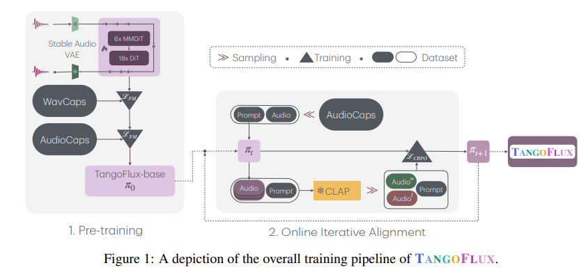
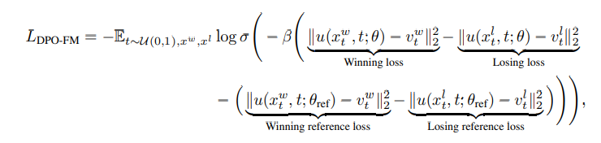

# TANGOFLUX : Super Fast and Faithful Text to Audio Generation with Flow Matching and Clap-Ranked Preference Optimization

摘要：我们推出了 T A N G O F L U X ，这是一种高效的文本转音频 (TTA) 生成模型，具有 515M 个参数，能够在单个 A40 GPU 上**仅用 3.7 秒生成长达 30 秒的 44.1kHz 音频。**对齐 TTA 模型的一个关键挑战在于难以创建偏好对，因为 TTA 缺乏可验证奖励或大型语言模型 (LLM) 可用的标准答案等结构化机制。为了解决这个问题，我们提出了 CLAP 排序偏好优化 (CRPO)，这是一种新颖的框架，可迭代生成和优化偏好数据以增强 TTA 对齐。我们证明使用 CRPO 生成的音频偏好数据集优于现有替代方案。借助该框架，T A N G O F L U X 在客观和主观基准测试中均实现了最佳性能。我们开源所有代码和模型，以支持对 TTA 生成的进一步研究。

问题：幻觉问题，occasionally struggling to fully capture the details in the input prompts, especially when the prompts are complex. At times, the generated audio may even contain input-adjacent, but unmentioned and unintended, events, that could be characterized as hallucinations.

文本上解决幻觉主要是通过RLHF训练，但是这一块再TTS上得尝试还比较欠缺。主要的瓶颈在于参照对得给构建。现有方案，如果是以音频大模型输入音频输出对应得文本得效果不足，如果是人工标注得话成本太高，因此本文提出了使用CLAP-Ranked Preference Optimization，一个简单有些得生成参照数据对得方法，同时能够perform preference optimization on rectified flows.

CLAP model (Wu\* et al., 2023) 能够作为一个潜在得reward模型，通过语音与文本得对齐情况来对音频进行排序。

贡献：

* a small and fast TTA model based on rectified flow that achieves state-of-the-art performance for fully non-proprietary training data.
* CRPO, a simple and effective strategy to generate audio preference data and align rectified flow, demonstrating its superior performance over other audio preference datasets.
* We conduct extensive experiments and highlight the importance of each component of CRPO in aligning rectified flows for improving scores on benchmarks
* We publicly release the code and model weights to foster research on text-to-audio generation.

---

方法：

模型架构：

consists of FluxTransformer blocks which are Diffusion Transformer (DiT) (Peebles & Xie, 2023) and Multimodal Diffusion Transformer (MMDiT) (Esser et al., 2024), **conditioned on textual prompt and duration embedding to generate audio at 44.1kHz up to 30 seconds.**

**rectified flow：**trajectory from audio latent representation encoded by a variational autoencoder (VAE)；

训练pipline:

* pre-training
* fine-tuning
* preference optimization

音频编码：

使用Stable Audio Open (Evans et al., 2024c)中得VAE编码器部分，整个VAE再训练过程中保持不变。

MODEL CONDITIONING：

为了生成任意长度得音频，应用了文本和音频长度两个条件，Textual conditioning controls the event present of the generated audio based on a provided description, while duration conditioning specifies the desired audio length, up to a maximum of 30 seconds.

使用FLAN-T5作为文本编码器，

长度编码器：we firstly use a small neural network to encode the audio duration into a duration embedding cdur. This is concatenated with the text encoding ctext and fed into TANGOFLUX to control the duration of audio output.

---

MODEL ARCHITECTURE

These lead us to select a model architecture consisting of 6 blocks of MMDiT, followed by 18 blocks of DiT. Each block uses 8 attention heads, with each attention head dimension of 128, resulting in a width of 1024. This configuration results in a model with 515M parameters.

FLOW MATCHING

In contrast, the flow matching (FM) framework (Lipman et al., 2023; Albergo & Vanden-Eijnden, 2023) has been shown to be more robust to the choice of noise scheduler, making it a preferred choice in many applications.

Rectified Flows:

in which the forward process are straight paths between target distribution and noise distribution, defined in Eq. (1). It was empirically demonstrated that rectified flows are sample efficient and degrade less compared to other formulations when reducing lesser number of sampling steps.

**Inference**. During inference, we sample a noise from prior distribution x˜0 ∼ N (0, I) and use an ordinary differential equation solver to compute x1, based on the model-predicted velocity vt at each time step t. We use the Euler solver for this process.

---

CLAP-RANKED PREFERENCE OPTIMIZATION:

* batched online data generation
* reward estimation and preference dataset creation
* fine-tuning πk into πk+1 via direct preference optimization

we demonstrate that using CLAP as a judge to choose the best-of-N inferred policies improves performance in terms of objective metrics.

DPO-Diffusion:

$$
L_{CRPO} = L_{DPO-FM} + L_{FM}
$$

---

训练数据集：

400k audios from Wavcaps

45k audios from the training set of AudioCaps

For audios shorter than 30 seconds, we pad the remaining audio with silence. For audios longer than 30 seconds, we perform center cropping of 30 seconds. Since the audio files are all mono, we duplicated the channel to create ”stereo” audio for compatibility with our model.

CRPO dataset：

We initialize the prompt bank as the prompts of AudioCaps training set, with a total of 45k prompts. At the start of each iteration of CRPO, we randomly sample 20k prompts from the prompt bank and generate 5 audios per prompt, and use the CLAP model to construct 20k preference pairs.

Evaluation dataset： AudioCaps test set

---

模型比较：

- 在AudioCaps的几乎所有客观指标上，TANGOFLUX的表现都优于先前的相关成果，尤其在处理包含多个事件的提示语时更是如此。

- 它在FDopenl3、CLAP分数以及起始分数（Inception Score，简称IS）方面都取得了卓越的性能，并且效率显著提升（推理时间最短）。

- 只有Tango 2在KLpasst指标上略胜TANGOFLUX一筹。

多事件提示语：

- 对于多事件输入，TANGOFLUX与基线模型之间在CLAP分数上的差距更大，这表明它具备处理复杂且细微场景的能力。

训练策略：

- 在线批量数据生成的效果显著优于离线策略，可防止因过度优化而导致的性能下降。

- 在多次迭代过程中，在线训练能使CLAP分数和KLpasst持续稳步提升。

偏好优化：

- 在所有指标方面，CRPO数据集相较于其他偏好数据集（如BATON和Audio - Alpaca）能带来更好的结果。

- 在“最佳N项”策略中，N值越大，CLAP分数和KLpasst就越高，这验证了CLAP作为一种有效奖励模型的作用。

优化技术：

- 与LDPO - FM相比，LCRPO展现出更稳定且更有效的优化效果，其性能饱和现象有所减少，基准测试结果也更佳。

- 通过LCRPO实现的优化指标的可控增长凸显了它在矫正训练过程方面的稳健性。

推理时间：

- TANGOFLUX在具备卓越性能的同时，其推理时间也短得多，与其他模型相比效率更高。

- 在较少的采样步骤下，TANGOFLUX相较于其他模型，性能下降幅度更小。

---

DiT: https://www.cvmart.net/community/detail/8508
