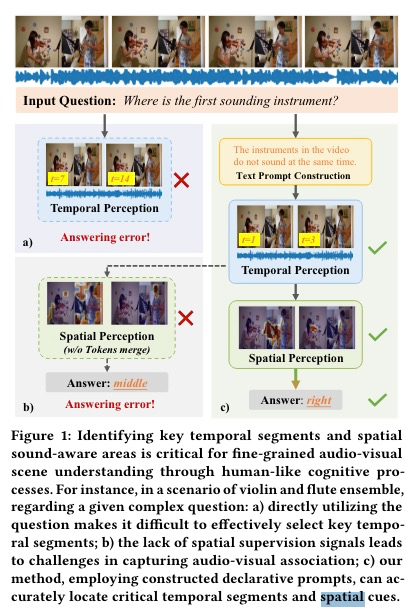
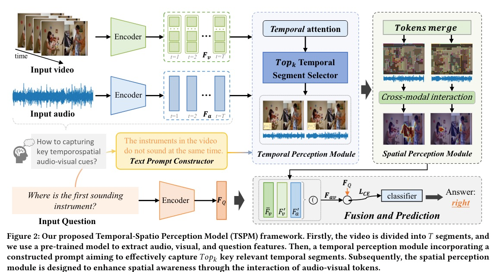
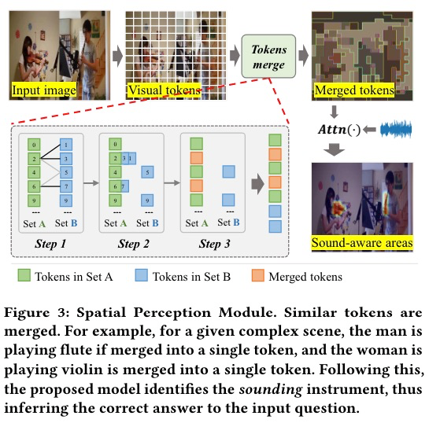

# Boosting Audio Visual Question Answering via Key Semantic-Aware Cues
人民大学在7月30号发表的关于音频视觉问答任务的模型，目的是回答视频关于各种视觉对象，音频以及他们之间的交互的问题。
视频中包含有丰富的视觉和音频对象，然后他们之中仅有少部分是与问题相关的。**因此，有效感知与给定问题相关的视听线索对于正确回答问题至关重要。**
这篇论文主要提出了一个时空感知模型来解决这个问题，重点在于提升模型感知与问题相关的关键视觉和听觉线索的能力，主要的做法是**通过问题模板派生的陈述性句子提示，**
以协助**时间感知模块**更好地识别与问题相关的关键片段，**空间感知模块**用于合并选择的片段中的视觉token，这一步骤之是通过与音频进行跨模态交互来实现的。最后，
这两个模块整合起来用户回答最后的问题。在多个音视问答的基准上都显示我们的模型不仅能够很好的理解视听线索，同时也能够有效的回答复杂的问题；
***
Audio Visual Question Answering任务指的是和音频视频都相关的任务，比如：视频中的那个乐器第一个发出声音？谁先发出笑声？

***
AVQA：数据集： MUSIC-AVQA ，Pano-AVQA
如何选取关键帧：均匀采样，CLIP相似度；
如何选取空间位置：使用ViT将视频帧转化成token序列，通过query和token之间的相似度来选择关键的token，但是忽略了其中的音频信息；
提出了TSPM来解决这些问题；
首先使用**Text Prompt Constructor**，相当于问题改写，目前是能够更好的识别关键帧。使用TPM定位关键帧，然后定位关键帧中的关键视觉区域和音频片段，
学习音频和视频之间的关联模块。SPM在选择的帧上合并视觉token，获得潜在目标的语义信息，然后这些token与音频token进行跨模态交互。最终，混合所有的这些特征，
获得最终的表示。

***
首先是对输入数据的处理：先分成T个没有重叠的音频和视频patch，每个patch长度为1s。然后将每个视频帧分为M个patches并在每个开始处添加[CLS]token；
问题被分为N个单词；
* 音频表示：使用VGGish模型来抽取；
* 视觉表示：对于每个视觉片段Vt采样固定数目的帧，使用CLIP模型来抽取帧级别和token级别的特征。

在不同的帧之间合并相似的图像token，在transformer中的每一层都执行token合并。合并后的token与合并前的token以及音频特征做交叉注意力。

***
数据集：
MUSIC-AVQA： 9288个短视频 45867个问答对。
AVQA： 通用日常场景，57,015个视频，57,335个问答对。
每1s作为一个片段，每个片段采样一帧图像。