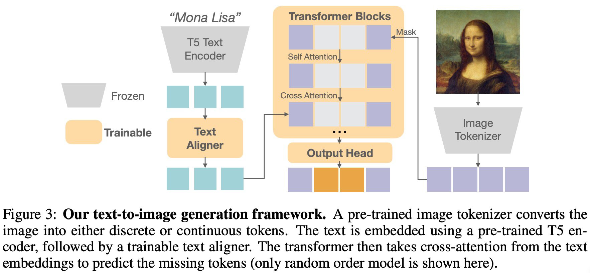

# Fluid: Scaling Autoregressive Text-to-image Generative Models with Continuous Tokens

摘要：在视觉中扩展自回归模型并未被证明像在大型语言模型中那样有益。在这项工作中，我们在文本到图像生成的背景下研究了这个缩放问题，重点关注两个关键因素：模型是使用离散标记还是连续标记，以及标记是使用类似 BERT 或 GPT 的 transformer 架构以随机还是固定的光栅顺序生成。我们的实证结果表明，虽然所有模型在验证损失方面都有效地扩展，但它们的评估性能（通过 FID、GenEval 分数和视觉质量衡量）遵循不同的趋势。**基于连续标记的模型比使用离散标记的模型具有明显更好的视觉质量。**此外，生成顺序和注意力机制会显著影响 GenEval 分数：**与栅格顺序模型相比，随机顺序模型的 GenEval 分数明显更高。**受这些发现的启发，我们训练了 Fluid，这是一种基于连续标记的随机顺序自回归模型。Fluid 10.5B 型号在 MS-COCO 30K 上实现了 6.16 分的零点 FID，在 GenEval 基准测试中获得了 0.69 的总分。我们希望我们的发现和结果将鼓励未来的努力，以进一步弥合视觉和语言模型之间的扩展差距。

缩放定律在自回归大语言模型上的成功应用，让大家思考计算机视觉领域中的自回归缩放定律，特别是对于图像到文本的生成任务。然而自回归模型生成的内容质量通常会低于其他的生成模型比如扩散模型。

对于这一现象，我们提示了几点假设：

* VQ操作会带来重大的信息损失，极大的限制了模型的表现
* 不同于语言本身的序列结构，图像内容生成可能从不同的生成顺序中获得收益
* 认为power- law只在使用同样的度量生成新数据这种情况下适用，在与训练目标不同的任务上并不适用

验证：在图文生成领域上设计了大量的实验。

* whether the model operates on continuous or discrete tokens, and whether tokens are generated in a random or fixed raster order.
* Diffusion loss + random order predict
* scale: 150M -> 3B
* loss, FID, GenEval loss

结论：

不论是随机顺序还是固定顺序，当模型参数量增加的时候，离散token FID的提升比连续token的提升要更小一些。

token生成的顺序以及相关联的注意力机制主要影响生成图片的整体结构。在GenEval benchmark上 随机生成顺序+双向注意力的模型明显优于固定生成顺序+causal attention（特别是在生成多目标的情况下）Random-order models can readjust the global structure at every prediction step, whereas raster-order models cannot. This suggests that the token generation order plays a crucial role in achieving better text-to-image alignment.（随机顺序的模型能够在每一步的预测中捕获**全局的结构**，但是固定顺序的模型不行）

验证loss会随着模型参数的增大呈现power-law，但是其他度量比如FID和GenEval虽然会随着更好的验证loss变好，但是不会严格遵守power- law。

最终：

根据这些实验发现，将Fluid模型，random-order model with continuous tokens, up to 10.5B parameters and train it using the WebLI dataset。取得了与最先进的图文生成模型相近的结果。DALL-E 3 和Stable Diffusion 3。

方法：

Discrete Tokenizer: VQGAN model, 16 X 16

Continuous Tokenizer: Stable Diffusion, 32 X 32 continuous tokens, each containing 4 channels.

For continuous tokens, we apply a six layer light-weight MLP as the diffusion head (Li et al., 2024) to model the per-token distribution
