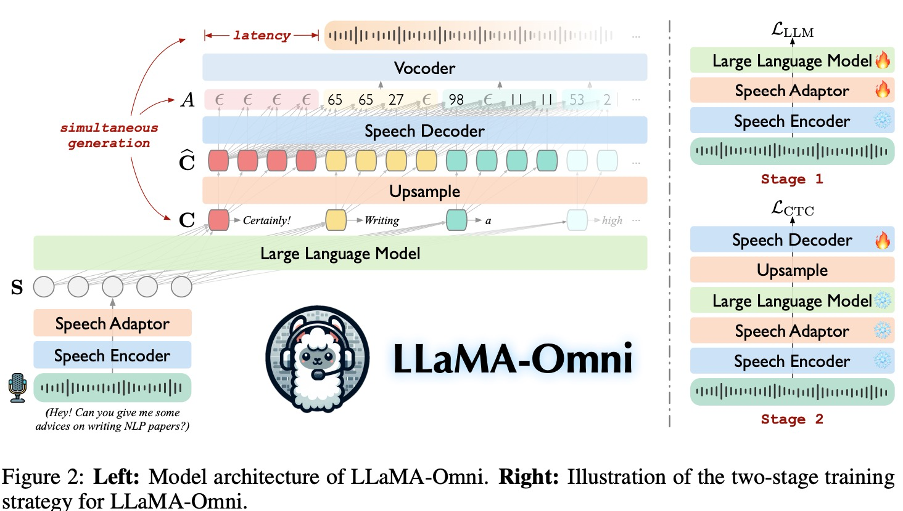

# LLAMA-OMNI: SEAMLESS SPEECH INTERACTION WITH LARGE LANGUAGE MODELS

摘要：exploration on how to build speech interaction models based on open-source LLMs。探索基于LLM构建语音交互模型。LLaMA-Omni整合了一个预训练的音频编码器，一个音频adapter，一个LLM以及一个streaming speech decoder。不需要ASR，并且能够以极低的延迟生成文本和语音回复，构建了InstructS2S-200K，包含了200K的语音指令和对应的语音回复。

* 基于开源模型构建的语音交互模块
* 回复延迟226ms
* 200K的语音指令微调数据，3天4GPU训练

---

The LLM decodes the text response directly from the speech instruction, without first transcribing the speech into text. The speech decoder is a non-autoregressive (NAR) streaming Transformer (Ma et al., 2023), **which takes the output hidden states of the LLM as input and uses connectionist temporal classification (CTC; Graves et al., 2006a) to predict the sequence of discrete units corresponding to the speech response. **During inference, as the LLM autoregressively generates the text response, the speech decoder **simultaneously** generates the corresponding discrete units.

---

为了更好地契合语音交互场景的特点，我们通过**重写现有的文本指令数据并进行语音合成**，构建了名为InstructS2S 200K的数据集。实验结果表明，LLaMAOmni 可以同时生成高质量的文本和语音响应，延迟低至 226 毫秒。此外，与 SpeechGPT（Zhang 等人，2023）等之前的语音语言模型相比，LLaMA-Omni 显着减少了所需的训练数据和计算资源，从而能够基于最新的 LLM 高效开发强大的语音交互模型。

---

MODEL: LLAMA-OMNI

音频编码器：Whisper-large-v3，训练时保持参数冻结

SPEECH ADAPTOR：下采样音频表示H（帧合并，Specifically, every k consecutive frames are concatenated along the feature dimension）

LARGE LANGUAGE MODEL: Llama-3.1-8B-Instruct

SPEECH DECODER:

使用HuBERT抽取音频的连续表示然后使用K-means模型将这些表示转化成离散的units.随后，连续的相同索引被合并成一个单元，产生最终的离散单元序列 YU

streaming speech decoder D (NAR streaming transformer): 输入是LLM输出的特征序列，输出是目标语音的离散unit表示，这两者使用CTC loss进行训练。

使用LLM输出的hidden-state作为输入生成与回复相关的unit 序列。

首先对LLM输出的hidden进行上采样，然后输入D生成hidden 序列 O，然后使用CTC loss将O与之前提取的YU进行对齐。**Specifically, CTC extends the output space with a special blank token ϵ**

---

训练：two-stage training strategy，首先训练从音频生成文本（固定音频编码器），然后训练模型生成语音回复。the speech encoder, speech adaptor, and LLM are all frozen, and only the speech decoder is trained using the objective L_CTC；

---

INFERENCE: LLM自回归的生成文本回复，同时音频解码器生成对应的音频离散单元。一旦LLM生成了文本回复前缀， prefix Y以及对应上采样之后的序列C，这些可以输入到speech decoder来生成paritial alignment A, 得到与生成回复的前缀相匹配的离散单元。当生成的离散单元达到一定数量后，会将他们一起输入到音频解码器中从而得到对应的音频，并且可以直接播放。

To further enable streaming synthesis of speech waveforms, when the number of generated units reaches a pre-defined chunk size Ω, we input this unit segment into the vocoder to synthesize a speech segment, which is then immediately played to the user.

---

模型训练：

<speech instruction, text response, speech response>

**音频回复合成：**

For the instructions, to make the synthesized speech sound more natural, we use the CosyVoice-300M-SFT (Du et al., 2024) model5 , randomly selecting either a male or female voice for each instruction. For the responses, we use the VITS (Kim et al., 2021) model6 trained on the LJSpeech (Ito & Johnson, 2017) dataset to synthesize the responses into a standard voice.

---
