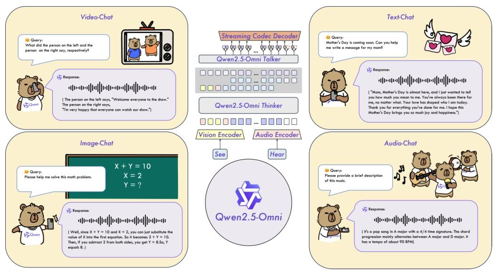
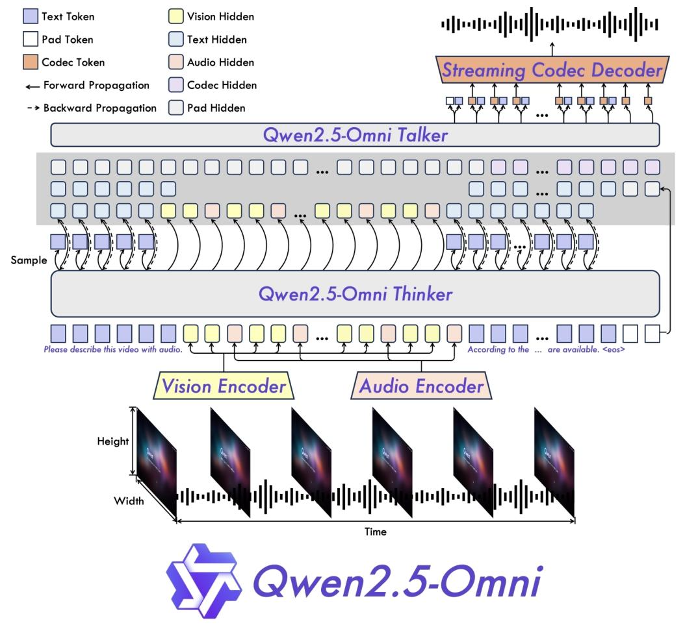
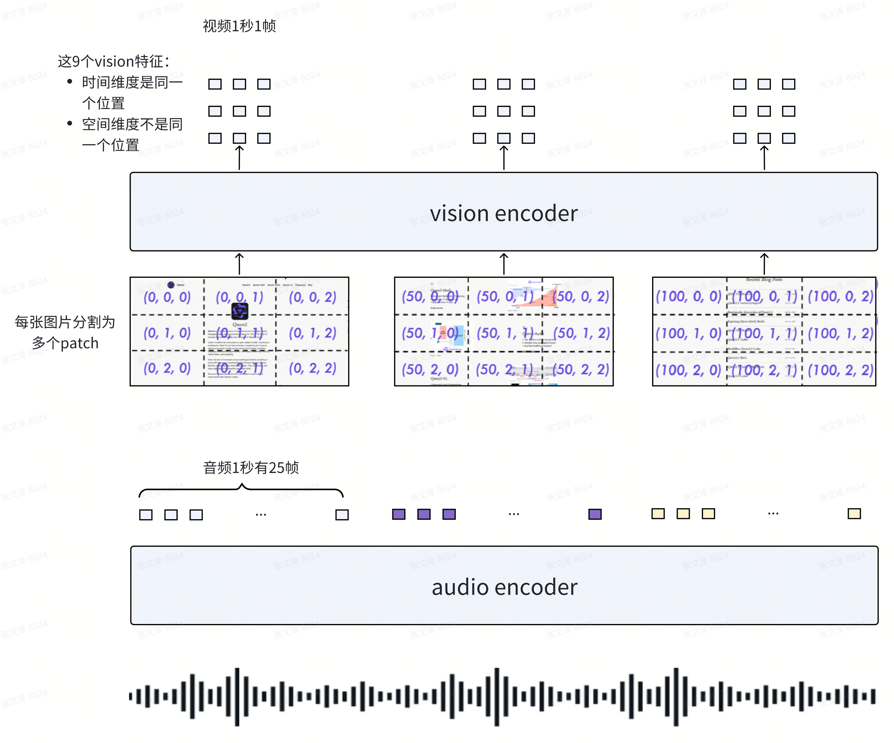

# Qwen2.5-Omni Technical Report

“Qwen2.5-Omni Technical Report” 由 Qwen Team 撰写。文章介绍了端到端多模态模型 Qwen2.5-Omni，它能感知多种模态信息并以流式方式生成文本和自然语音回应，在多模态基准测试中表现出色。

1. **模型架构**
   * **整体架构**：采用 Thinker-Talker 架构，Thinker 负责处理和理解多模态输入、生成文本，Talker 接收 Thinker 的输出并生成语音。
   * **感知模块**：对文本、音频、图像和视频等输入进行预处理和特征提取，提出 TMRoPE 算法同步音频和视频时间戳，采用**时间交织方法处理音频和视频信息**。
   * **生成模块**：Thinker 基于概率分布通过自回归采样生成文本；Talker 结合 Thinker 的高层表示和文本令牌嵌入生成音频令牌，使用 **qwen-tts-tokenizer** 高效表示语音关键信息。
   * **流式设计**：修改音频和视觉编码器支持块级注意力，提出滑动窗口块注意力机制，限制当前令牌访问上下文，提高流式输出质量。
2. **训练过程**
   * **预训练**：分三个阶段，第一阶段锁定 LLM 参数训练视觉和音频编码器；第二阶段解冻所有参数，使用更多多模态数据训练；第三阶段用长序列数据提升模型理解复杂长序列的能力。
   * **微调**：Thinker 使用 ChatML 格式的指令跟随数据进行微调；Talker 采用三阶段训练，包括学习上下文延续、利用 DPO 增强语音生成稳定性、进行多说话人指令微调提高自然度和可控性。
3. **评估结果**
   * **理解能力评估（X→Text）**：在文本→文本、音频→文本、图像→文本、视频（无音频）→文本和多模态→文本等任务上进行评估，结果显示 Qwen2.5-Omni 在多数任务上表现出色，与同类模型相比有竞争力。
   * **语音生成能力评估（X→Speech）**：评估零样本语音生成的内容一致性和说话人相似度，以及单说话人语音生成的稳定性和主观自然度，结果表明模型性能优异，接近人类水平。
4. **研究结论**：Qwen2.5-Omni 是一个能理解和生成多种模态的统一模型，在复杂视听交互和情感对话方面表现出色，未来将致力于开发更强大、更快且输出能力更丰富的模型。

---

摘要：这种策略有效地将长序列多模态数据的处理解耦，将感知任务交给多模态编码器，并将长序列的建模工作委托给大型语言模型。这样的分工通过共享注意力机制增强了不同模态的融合。为了使视频输入的时间戳与音频同步，我们以交错的方式按顺序组织音频和视频，并提出了一种新的位置嵌入方法，称为 TMRoPE（时间对齐的多模态旋转位置嵌入）。为了同时生成文本和语音并避免两种模态之间的干扰，我们提出了 Thinker-Talker 架构。在这个框架中，Thinker 充当负责文本生成的大型语言模型，而 Talker 是一个双轨自回归模型，它直接利用 Thinker 的隐藏表示来生成音频令牌作为输出。Thinker 和 Talker 模型都设计为以端到端的方式进行训练和推理。为了以流式方式解码音频令牌，我们引入了一种限制感受野的滑动窗口 DiT，旨在减少初始数据包延迟。

---

* 首先，实施一种系统的方法来联合训练文本、图像、视频和音频等各种模态至关重要，以此促进它们之间的相互提升。这种对齐对于视频内容尤其重要，因为在视频中，音频和视觉信号的时间同步是必要的。
* 其次，必须处理不同模态输出之间潜在的干扰，确保文本和语音令牌等输出的训练过程不会相互干扰。
* 最后，需要探索能够实时理解多模态信息并实现高效音频输出流的架构设计，从而减少初始延迟。

在本报告中，我们介绍了 Qwen2.5-Omni，这是一个统一的单一模型，能够处理多种模态，并以流式格式同时生成文本和自然语音回复。为应对第一个挑战，我们提出了一种新颖的位置嵌入方法，称为 TMRoPE（时间对齐的多模态旋转位置嵌入）。我们以交错结构组织这些音频和视频帧，以便按时间顺序表示视频序列。针对第二个挑战，我们提出了 Thinker-Talker 架构，其中 Thinker 负责文本生成，而 Talker 专注于生成流式语音令牌。Talker 直接从 Thinker 接收高层表示。这种设计的灵感来自于人类利用不同器官产生各种信号的方式，这些信号通过相同的神经网络同时进行协调。因此，Thinker-Talker 架构是端到端联合训练的，每个组件都专门用于生成不同的信号。为解决与流式处理相关的挑战，并便于对多模态信号进行实时理解所需的预填充，我们通过采用分块流式处理方法对所有多模态编码器进行了改进。为支持流式语音生成，我们实现了一个双轨自回归模型来生成语音令牌，同时还有一个 DiT 模型将这些令牌转换为波形，从而实现流式音频生成并最大限度地减少初始延迟。这种设计旨在使模型能够实时处理多模态信息，并有效地执行预填充，从而能够同时生成文本和语音信号。

与同等规模的单模态模型相比，Qwen2.5-Omni 在所有模态上都展现出了强大的性能。它显著提升了遵循语音指令的能力，达到了与纯文本输入相当的性能水平。对于那些涉及整合多种模态的任务，比如在 OmniBench（李等人，2024b）中所评估的任务，Qwen2.5-Omni 取得了领先的性能表现。值得注意的是，Qwen2.5-Omni 在 seed-tts-eval（阿纳斯塔西奥等人，2024）上取得了优异的成绩，展现出了强大的语音生成能力。

文本、音频、图像和视频（不含音频轨道）。Thinker 通过将文本、音频、图像和视频（不含音频轨道）转换为一系列隐藏表示来进行处理，以作为输入。在对文本进行分词时，我们使用 Qwen 的分词器（杨等人，2024a），该分词器应用字节级字节对编码，其词表包含 151,643 个常规词元。对于音频输入以及视频中的音频，我们将其重采样至 16 千赫兹的频率，并将原始波形转换为 128 通道的梅尔频谱图，窗口大小为 25 毫秒，跳变大小为 10 毫秒。我们采用来自 Qwen2-Audio 的音频编码器（朱等人，2024b），使每一帧音频表示大致对应于原始音频信号 40 毫秒的片段。此外，我们使用 Qwen2.5-VL 的视觉编码器（白等人，2025），该编码器基于拥有约 6.75 亿参数的视觉 Transformer（ViT）模型，使其能够有效地处理图像和视频输入。视觉编码器采用结合了图像和视频数据的混合训练方案，以确保在图像理解和视频理解方面的熟练程度。为了在适应音频采样率的同时尽可能完整地保留视频信息，我们使用动态帧率对视频进行采样。另外，为了保持一致性，每张图像都被当作两帧相同的画面来处理。

在处理图像时，每个视觉标记的时间ID保持不变，而根据标记在图像中的位置，为高度和宽度分量分配不同的ID。当输入是带有音频的视频时，音频仍然按照每帧40毫秒的相同位置ID进行编码，视频则被视为一系列图像，每帧的时间ID递增，而高度和宽度分量遵循与图像相同的ID分配模式。**由于视频中的帧率不固定，我们根据每帧对应的实际时间动态调整帧间的时间ID，以确保一个时间ID对应40毫秒。**在模型的输入包含多种模态的场景中，每种模态的位置编号通过将前一种模态的最大位置ID加一来进行初始化。TMRoPE增强了位置信息建模，最大限度地实现了各种模态的融合，使Qwen2.5-Omni能够同时理解和分析来自多种模态的信息。

在将位置信息融入到每个模态中之后，我们按顺序排列这些表示。**为了使模型能够同时接收视觉和听觉信息，如图 3 所示，对于带有音频的视频，我们采用了一种特殊的设计，即时间交织方法。根据实际时间，将带有音频的视频中的表示分割成每 2 秒一段。然后，在这 2 秒的时间内，我们将视觉表示排在前面，音频表示排在后面，对带有音频的视频的表示进行交织处理。**

* Qwen2.5-omni提出Time-aligned Multimodal RoPE (TMRoPE)
  > 1. 采用3个维度对位置进行编码：时间、width、height
  > 2. 把这3个位置编码拼接在一起作为最终的位置编码
  > 3. 以音频的**时间****维度**作为基准：视频第1秒编码为0，第2秒编码为25，第3秒为50 ...
  > 4. 音频和文本同样采用3个维度进行编码，只不过所有维度都与时间维度采用同一个编码
  >    1. 例如：(0,0,0)、(1,1,1)、(2,2,2) ...
  >

* 音视频输入到LLM的方法：
  > 1. 视频和音频按时间顺序排开
  > 2. 3维位置编码拼接为一个向量，作为RoPE的位置编码（图中简化成和音视频特征相加了）
  > 3. 利用这种方式，实现音频和视频在时间维度上的对齐，同时保持了视频特征的空间位置信息
  > 4. 在每个2秒区间内，视频放前面、音频放在后面，通过位置编码区分时间顺序
  >

5. ## Pre-training
6. 冻结LLM，训练audio encoder和vision encoder

   > * 采用audio-text、image-text数据训练
   > * Audio encoder、vision encoder 与 LLM 之间，分别有一个adapter，需要预先训练adapter，再训练audio encoder和vision encoder；这个训练步骤对于模型整体的鲁棒性，非常重要。
   >
7. LLM + audio encoder + vision encoder 一块训练

   > * 在第1步的预训练数据基础上，额外再加入的数据量：
   >   * 800 billion 图片+视频相关的 token
   >   * 300 billion 音频相关的 token （粗略估计300万小时数据：40ms一帧、1秒25个token，假设音频比文本长得多，不考虑文本token数，300\*10^9/25/3600）
   >   * 100 billion 音视频相关的 token
   > * 这些训练数据包含了多模态、多任务，可以让模型能处理真实世界的问题
   > * 在多模态训练数据之外，纯文本训练数据，用来有效维持和改进LLM原本具有的语义理解能力
   >
8. 模型context长度从8k扩展到32k，增强长上下文理解能力
