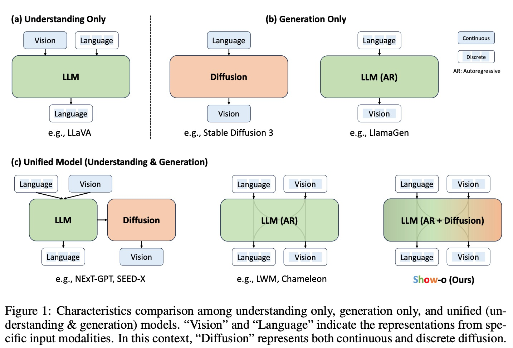
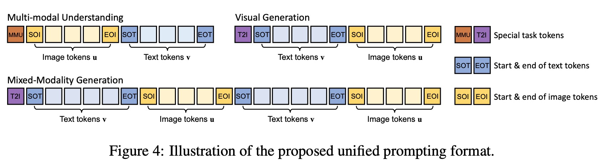
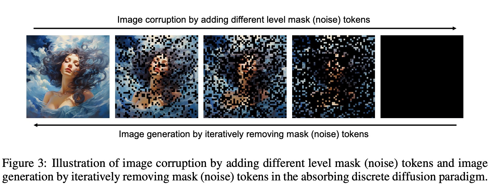

# SHOW-O: ONE SINGLE TRANSFORMER TO UNIFY MULTIMODAL UNDERSTANDING AND GENERATION

摘要：我们提出了一个统一的转换器，即 Show-o，它统一了多模态理解和生成。与完全自回归模型不同，Show-o 统一了自回归和（离散）扩散建模，以自适应地处理各种混合模态的输入和输出。统一模型灵活支持广泛的视觉语言任务，包括视觉问答、文本到图像生成、文本引导的修复/外推和混合模态生成。在各种基准测试中，它表现出与现有单个模型相当或更好的性能，具有相同或更多数量的专为理解或生成而定制的参数。这显着凸显了其作为下一代基础模型的潜力。

现状：理解一般使用transformer,生成一般使用扩散模型；现有的模型一般使用集成的专家模型来综合不同领域的能力，这些方法treat each domain independently and often involve individual models responsible for understanding and generation separately。都是不同模型的组合。

核心问题：

**can one single transformer handle both multimodal understanding and generation?**

自回归的生成图像：主要问题是当处理高分辨率的图像或者视频时需要大量的采样步骤，扩散模型类的方法exhibited superior capabilities in visual generation than autoregressive ones and are in full attention.

can such one single transformer involve both autoregressive and diffusion modeling?

Show-o：

* employ the **discrete denoising diffusion** to model discrete image tokens instead of continuous diffusion used in existing works
* inherently encodes text conditional information, eliminating additional text encoders.
* Consequently, given an image accompanying questions, Show-o gives the answers autoregressively. When provided only text tokens, Show-o generates images in a style of discrete denoising diffusion.

核心贡献：

* We present a unified model, i.e., Show-o, which unifies multimodal understanding and generation using one single transformer.
* Show-o innovatively unifies autoregressive and (discrete) diffusion modeling within one single transformer, demonstrating versatility in handling both text and images distinctly.
* As a unified model, Show-o demonstrates comparable even better performance to individual baseline models with an equivalent or larger number of parameters in multimodal understanding and generation benchmarks.
* Show-o inherently supports various downstream applications like text-based inpainting and extrapolation, without necessitating any fine-tuning. Besides, it also demonstrates the potential for mixed-modality generation. • We explore the impact of different types of representations (discrete or continuous) on multimodal understanding, providing valuable insights for improving multimodal understanding capabilities of a unified model.

相关工作：

自回归：

VideoPoet：decoder only transformer

LlamaGen:

扩散模型：

---

**Our Show-o model is built upon MaskGIT so that both such discrete visual and textual tokens can share a unified learning objective format.**

Absorbing-Uniform Discrete Diffusion:

---

* 如何定义模型的输入输出空间？

  * 将图片和文本都tokenize。
  * Image tokenize: MAGVIT-v2,train a lookup-free quantizer using around 35M image data. codebook 大小8192,将256 X 256的图像编码到16 X 16。
* 如何统一来自不同模块的各种输入数据？

  * the unified prompting strategy to structure the input data and modalities

  

  * 注意力机制（Omni-Attention）,image双向注意力，文本单向注意力。
* 如何在一个transformer中同时涉及自回归和扩散建模？

  * 使用预训练好的语言模型作为初始化，扩展embedding矩阵新增8192个图像token embedding。
  * 训练目标：Next Token Prediction 和 Mask Token Prediction(离散的扩散过程).使用文本token和未mask的图像token预测mask的图像token。

    
* 如何有效训练这样的一个统一模型？

  * present a three-stage training pipeline to effectively train the unified model.
    * Image Token Embedding and Pixel Dependency Learning：三个任务，语言模型，class-conditional image generation（image-net 1k中的标签名称作为文本），image captioning；
    * Image-Text Alignment for Multimodal Understanding and Generation：text-to-image任务主要集中与图片标题和文本到图像生成任务；
    * High-Quality Data Fine-tuning：高质量的图文对以及指令数据；

推理：

图像生成推理的时候，先根据M个mask token以文本为条件生成logits_t，同时生成unconditional logits_t2,计算最终的logits, $L_t = (1+w)l_{c}^{t}-wl_{u}^{t}$

将高logits的token替换为预测token，保持低logits的token为[MASK] token，进行下一轮的迭代生成。
