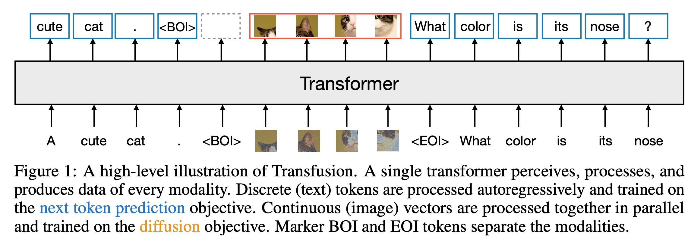
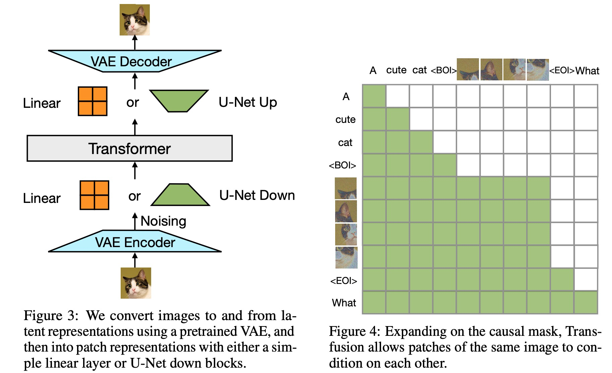

# Transfusion: Predict the Next Token and Diffuse Images with One Multi-Modal Model

摘要：提供了一个在离散和连续数据上训练多模态模型的方案。在图文混合数据上从头开始训练了一个7B的模型。实验表明：T**ransfusion scales significantly better than quantizing images and training a language model over discrete image tokens.**通过引入模块特定的编码和解码层，能够进一步提升效果，并且能够将每个图片压缩到16个patch。在7B模型和2T token级别的训练。

---

50%的文本数据和50%的图像数据，文本的训练目标是NTP(单向注意力)，图片的训练方式是diffusion（双向注意力）。

* 图像内的双向注意力很重要，如果替换会降低text-to-image的生成效果。
* 在图像编码和解码器上添加U-Net的上采样和下采样模块有助于压缩大的图像pathches,同时对效果的影响很小；
* 1T文本token和692M image-caption数据（5epoch）数据训练，在图像生成上超越了DALL-E 2 and SDXL，同时在文本上取得了和llama1相同的效果。

**Latent Image Representation**

**Our main innovation is demonstrating that we can use separate losses for different modalities – language modeling for text, diffusion for images – over shared data and parameters.**

---

Latent Image Representation We train a 86M parameter VAE following Esser et al. [2021]. We use a CNN encoder and decoder, and latent dimension 8. The training objective is combines reconstruction and regularization losses.14 Our implementation reduces an image of 256×256 pixels to a 32×32×8 tensor, where each latent 8-dimensional latent pixel represents (conceptually) an 8×8 pixel patch in the original image, and trains for 1M steps.
